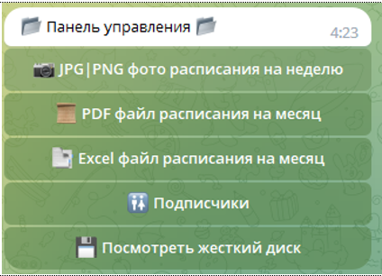
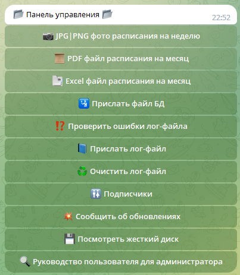

###### Версия бота 1.4:

# Общее описание бота

Данный [бот](https://t.me/hramiosif_calendar_bot) разработан для [Храма Иосифа Волоцкого](http://hramiosif.ru/)
(Ленинский район, пос. Развилка) и позволяет всем желающим легко и быстро получить расписание на конкретный день,
неделю или месяц (расписание обновляется каждый месяц).

## Описание файловой структуры

- ***dir:*** christian_calendar - директория с файлами для работы с API православного календаря (данная функция пока что
  находится
  в разработке)
- ***dir:*** commands - все команды бота
- ***dir:*** excel_utils - всё для работы с Excel файлами
- ***dir:*** hdd - жесткий диск бота для хранения документов и данных (логи, расписания, БД)
- ***dir:*** keyboards_for_bot - все клавиатуры бота
- ***dir:*** utils - дополнительные функции (в том числе для логирования и работы с БД)
- ***file:*** errors.py - кастомные ошибки
- ***file:*** loader.py - загрузочный файл со всеми переменными
- ***file:*** main.py - главный файл
- ***file:*** message_handler.py - перехватчик всех отправляемых команд Пользователем боту
- ***file:*** .env - файл, в котором хранятся переменные окружения. Это файл, который содержится в gitignore и хранит в
  себе
- необходимые для работы Бота секретные данные
- ***file:*** .env.template - файл, в который является примером заполнения файла .env
- ***file:*** xls_schedule.template.xlsx - шаблон Excel расписания

### Пользователи бота

Пользователи бота делятся на две категории: *Старший администратор*, *обычный администратор* (и тех и других может быть
один или больше) и *обычные пользователи*.

### Типы расписания

- На конкретный день (текстом)
- На текущую неделю
    - В виде текста
    - В виде фотографии
- На следующую неделю
    - В виде текста
    - В виде фотографии
- На месяц (файлом)

### Поддерживаемые типы файлов

Есть три типа файлов, с которыми работает бот, и в формате которых хранятся или отображаются расписания:

1. Excel (только хранение)
2. IMG | PNG Фотография (хранение и отображение)
3. PDF документ (хранение и отображение)

Данные в формате Excel необходимы для формирования текстового расписания. На конкретный день, на текущую или следующую
неделю. Данные заполняются в специальный шаблон, далее администратор загружает файл в бота.
Фотографии используются для отправки расписания на неделю в виде фотографии, файл, соответственно, в виде файла на
месяц

### Обновление расписания

Обновление расписания происходит непосредственно через бот. Администратор заполняет заранее определенный шаблон файла
Excel. [Шаблон](hdd/README_add_files/xls_schedule.template.xlsx). Через меню /admin обращается к команде "Excel расписание на месяц". 
Далее бот расшифровывает файл, используя библиотеку Pandas, и пересохраняет все по файлам расширения .json. В 
зависимости от результатов бот сообщает удалось сохранить новое расписание или нет.

### Администратор

Ознакомиться с доступными командами рядовому администратору можно в [инструкции](hdd\admin_manual\admin_manual.docx)

Для администратора все взаимодействие с ботом происходит через специальную команду `/admin`.
Перечень доступных команд для рядового администратора:

У Старшего администратора перечень команд больше, так как имеются небезопасные команды (в частности, удаление файлов).
Перечень доступных команд для Старшего администратора:

### Пользователь

Предлагаю Вам самостоятельно узнать какие команды бот предлагает Пользователю :)
Переходите по [ссылке](https://t.me/hramiosif_calendar_bot)
